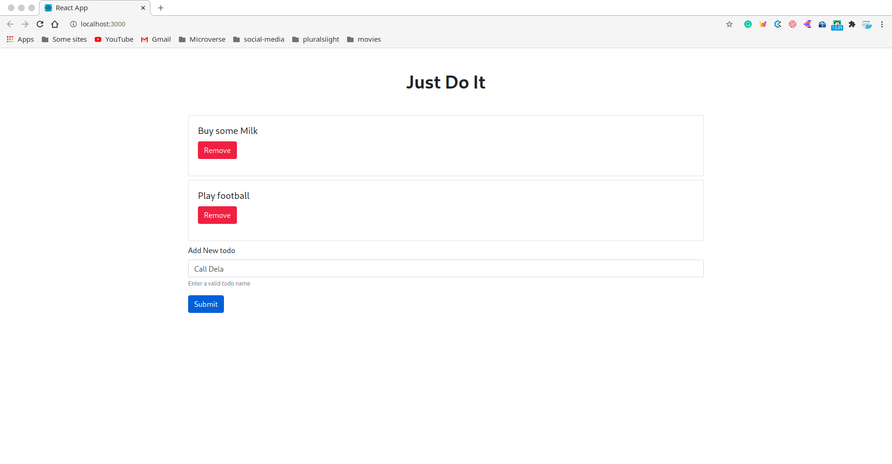

# reactToDo
A to do app using React Js

What the project contains:
- A basic React form to add Todos
- A button to remove todos
- localstorage to store and retrieve todos

## Built with

- Javascript.
- React
- Bootstrap

## Live Demo

[Live link]()

## Getting Started

- Clone the repository on your local machine;
- Cd into the folder;
- Run `npm install`
- Run `npx start`;
- visit http://localhost:3000/

👤 **Kelly Booster**

- Github: [@kelibst](https://github.com/kelibst)
- Twitter: [@keli_booster](https://twitter.com/keli_booster)
- Linkedin: [Kekeli (Jiresse) Dogbevi
](https://www.linkedin.com/in/kekeli-dogbevi-jiresse/)

## 🤝 Contributing

Contributions, issues and feature requests are welcome! Start by:

- Forking the project
- Cloning the project to your local machine
- `cd` into the project directory
- Run `git checkout -b your-branch-name`
- Make your contributions
- Push your branch up to your forked repository
- Open a Pull Request with a detailed description to the development branch of the original project for a review

## Show your support

Give a ⭐️ if you like this project!